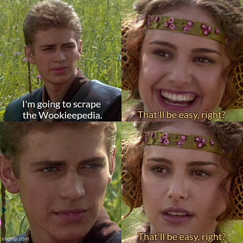
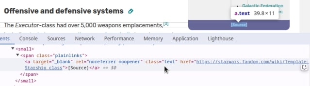
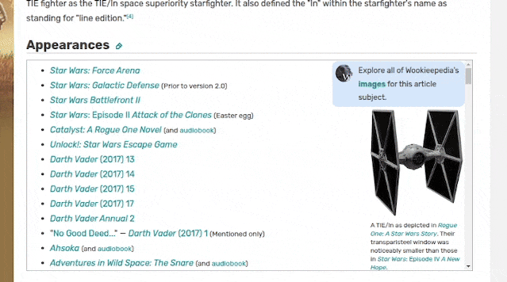

# Unofficial Star Wars Databank

---

## About
A simple website with vehicles from the Star Wars universe.  
Including its factions, manufacturers, types, lines and appearances.

The content is parsed from the [Wookieepedia](https://starwars.fandom.com/wiki/Main_Page) articles (except series covers).

### Stack
#### Main website:
- **PHP 8.4**
- **PostgreSQL 17**
- **Nginx 1.27**
- **Laravel 11** with default Blade template engine and some TypeScript and SCSS on top
- **[Orchid](https://orchid.software/)** as admin panel
- **[Imgproxy](https://imgproxy.net/)** to serve images in different sizes
- **[RabbitMQ](https://www.rabbitmq.com/)** to receive scraped data

#### Wookieepedia scraper:
- **Go 1.23**
- **[Colly](https://github.com/gocolly/colly) v2** to scrape data

---

## Credits
UI is heavily inspired by **[Star Wars Battlefront (2015)](https://www.gameuidatabase.com/gameData.php?id=362)**.

Fonts:
- **[Gabarito](https://fonts.google.com/specimen/Gabarito)** by *Naipe Foundry* for titles.
- **[FT Aurebesh](https://fontesk.com/ft-aurebesh-font/)** by *Rodrigo Fuenzalida* for titles in Aurebesh.
- **[Montserrat](https://fonts.google.com/specimen/Montserrat)** by *Julieta Ulanovsky* for main text.
- **[Rogue AF](https://aurekfonts.github.io/?font=RogueAF)** by *AurekFonts* for small icons (titles, filters, etc.).

Some colors were taken from **[Star Wars UI Library](https://www.figma.com/community/file/975862977200081795)** by *Matt Walker*.

Nginx config for Imgproxy is based on the **[docker-imgproxy](https://github.com/shinsenter/docker-imgproxy)** repository by *Mai Nhut Tan*.

---

## Development process
One day I was wondering: *"How many vehicles exist in the Star Wars universe? Which factions used them? Who manufactured them?"*

There is an official [Star Wars Databank](https://www.starwars.com/databank) website, but I got a feeling that this is not enough.  
So I went to the [Wookieepedia](https://starwars.fandom.com/wiki/Main_Page)...

Let's see how many pages there are:  

Okay, but how do I find the vehicles?

There is special *"All pages"* page https://starwars.fandom.com/wiki/Special:AllPages with all available articles.  
But it will take you ages to manually visit all of them.

Let's try something more specific:
- The *"Starship types"* page?  
https://starwars.fandom.com/wiki/Category:Starship_types
- Or maybe the *"Starships by type"* page?  
https://starwars.fandom.com/wiki/Category:Starships_by_type
- Or just the *"Starships"* page?  
https://starwars.fandom.com/wiki/Category:Starships

Still not good enough...

And what if I want more than just starships?  
I need to see all the available vehicles from a galaxy far, far away.

### Just write a scraper! *How hard can it be?*
The algorithm is simple:
1. Go to the first "nav" page https://starwars.fandom.com/wiki/Special:AllPages.
2. Check every page found here and scrape those containing *"vehicle"* information.
3. Go to the next "nav" page.
4. Repeat the process from step 2.
5. ?
6. Profit.

### Problem 1. How to identify the "vehicle" page?
Each page has its own "template", and there are many of them.

For example **"[Executor-class Star Dreadnought](https://starwars.fandom.com/wiki/Executor-class_Star_Dreadnought/Legends)"** has the *"Starship_class"* template:  

#### Solution: Analyze several dozen pages and define the list of templates for the "vehicle" page:
- *"Air_vehicle"*
- *"Aquatic_vehicle"*
- *"Ground_vehicle"*
- *"Repulsorlift_vehicle"*
- *"Space_station"*
- *"Starship_class"*
- *"Vehicle"*

There is also the *"Ship_series"* template, but it is too common, so it will not be scraped.

### Problem 2. Appearances.
Most of the vehicles pages have an **"Appearances"** section, for example **"[TIE/ln space superiority starfighter](https://starwars.fandom.com/wiki/TIE/ln_space_superiority_starfighter)"**:  

465 items total...for just one vehicle...

I am not familiar with most books, comics, or video games, so I would prefer not to scrape them.  
I also do not want to know if vehicle appears in some kind of young-reader novels (or "Acolyte").

Some of the appearances have the following notes: *"In flashback(s)"*, *"Mentioned only"*, *"Appears in hologram"*, *"Cover only"*, *"Indirectly mentioned only"*, *"Appears in grafitti"*, and so on.  
I would prefer not to scrape any of these either.

#### Solution: Define custom "Major Appearance" criteria:
1. The appearance should be one of the following titles:
   - main films (original trilogy, prequels, sequels);
   - series (except animated, because of the artistic style);
   - not too old games (prior to 2002 because of low-poly 3D models or poor quality screenshots).
2. The appearance must be "direct" (*note should be empty, or "First appearance", or "DLC" for games*).

### Problem 3. Factions.
Most of the vehicles belong to some Faction.  
But there are too many of them, some I have never heard of.

#### Solution: Keep only the "major" Factions:
- Alliance to Restore the Republic;
- Confederacy of Independent Systems;
- First Order;
- Galactic Empire;
- Galactic Republic;
- Jedi Order;
- New Republic;
- Resistance;
- Sith.

I had my doubts about the *"Trade Federation"*, because it appeared in Episodes I-III, but in the end, I decided that it would remain as part of the *"Confederation of Independent Systems"*.

### Problem 4. Lines and Manufacturers.
Some of the vehicles may be part of a Line, such as **"[TIE series](https://starwars.fandom.com/wiki/TIE_series)"**.  
However, these Lines may be named differently on different pages.  
For example, *"All terrain"*, *"All terrain armored transport"* and *"All-terrain vehicle"* are the same Line.

The same applies to Manufacturers.  
For example, *"Cygnus spaceworks"* and *"Cygnus Space Workshops"* are the same Manufacturer.

#### Solution: Combine these "similar" Lines or Manufacturers into a single entities.

At this moment there are 10 "similar" Lines:

| "Similar" name                                           | Final name                     |
|----------------------------------------------------------|--------------------------------|
| Acclamator-Class Assault Ship                            | Acclamator-class               |
| All Terrain / All Terrain Armored Transport              | All-terrain vehicle            |
| BTL Y-wing Starfighter / BTL Y-wing / Y-wing Starfighter | Y-wing                         |
| Delta Fighter                                            | Delta series                   |
| J-type Star Skiff                                        | J-type                         |
| LAAT                                                     | Low Altitude Assault Transport |
| Lucrehulk-Class                                          | Lucrehulk                      |
| MC80 Star Cruisers                                       | MC Star Sruiser                |
| TIE Series / TIE Fighter                                 | TIE Series                     |
| X-wing Starfighter                                       | X-wing                         |

And only 3 "similar" Manufacturers:

| "Similar" name             | Final name                         |
|----------------------------|------------------------------------|
| Cygnus Spaceworks          | Cygnus Space Workshops             |
| Haor Chall Egineering      | Haor Chall Engineering Corporation |
| Hoersch-Kessel Drive, Inc. | Hoersch-Kessel Drive Inc.          |

### Problem 5. The "new canon".
After Disney bought Lucasfilm in 2012, almost all the old content became *"Legends"*.

Now, most of the articles exist in two versions: **"Canon"** and **"Legends"**, and contain *slightly* different information.

For example:
- [Aggressive ReConnaissance-170 starfighter (Canon)](https://starwars.fandom.com/wiki/Aggressive_ReConnaissance-170_starfighter)
- [Aggressive ReConnaissance-170 starfighter (Legends)](https://starwars.fandom.com/wiki/Aggressive_ReConnaissance-170_starfighter/Legends)

Almost everything is different!
- Image
- Description
- Technical specifications
- Appearances

No, seriously, Disney...why?  
Why throw away almost everything that has been created over decades?  
Why not try to adapt it to your *"new canon"*?

#### Solution: Just accept that. Scrape both versions, but keep *"Canon"* articles as priority data.

## Result
After several days of trial and error, more than 195,000 pages were parsed.  
Almost 2,800 of them were related to vehicles, but only 549 met the final criteria and were imported.

And yet, some manual work was required:
- Disabling "phantom" vehicles, such as:
   - related to a specific unit (*e.g. "[Tempest Scout 1](https://starwars.fandom.com/wiki/Tempest_Scout_1)"*);
   - appeared only for a fraction of a second in the final battle of Episode IX (*e.g. "[Razor Assault Ship](https://starwars.fandom.com/wiki/Razor_Assault_Ship)"*);
   - I don't even know why these articles exist (*e.g. "[Sled](https://starwars.fandom.com/wiki/Sled)"*);
   - etc.
- Cleaning up Manufacturers that are not linked with any vehicle;
- Replacing incorrect or undetected "main" Factions for some vehicles;
- Fixing SVG emblems for some Factions;
- Removing most of the backgrounds.

In the end, only about 400 vehicles were worthy of being shown to the public.
